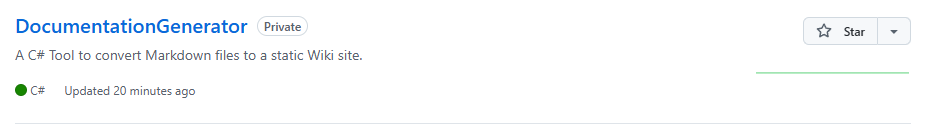

# Index
This is the home-page for the testing documentation.

## Images
This is an Image

When the Compiler finds markdown that links with an image, it automatically copies it to the `Build` folder so it shows up on the Built website.

## HTML Resource Linking
When the Compiler finds HTML that links with a resource (CSS, JS, etc), it automatically cocpies it to the `Build` folder so it shows up on the Built website.

## Code Blocks
Code Blocks will get their syntax highlighting from the `highlight.js` library.

## Hot Reloading
Changes in markdown automatically reflect on the hosted site. Like So!
